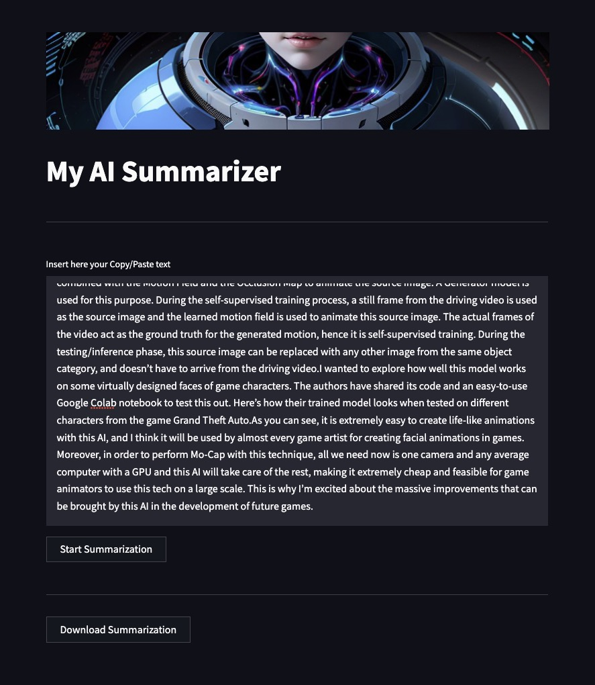

# ai-summarization

使用 HuggingFace 和 Python 使用免费大语言模型（LLM）来构建一个 Summarization 应用程序

## <a id="quick-start" href="#quick-start">🚀 Quick Start</a>

Create a virtual environment to run in.

```
python3 -m venv AISummary
source AISummary/bin/activate # ubuntu/Mac
AISummary\Scripts\activate # windows
pip3 install --upgrade pip

streamlit run AI-TextSummarizer.py
```

### 🐳 Docker Start

The easiest way to run ai-summarization locally is by using docker.

```
docker build -t ai-summarization .
docker run -d --name ai-summarization -p 8501:8501 ai-summarization
```

## You will see a result like this


